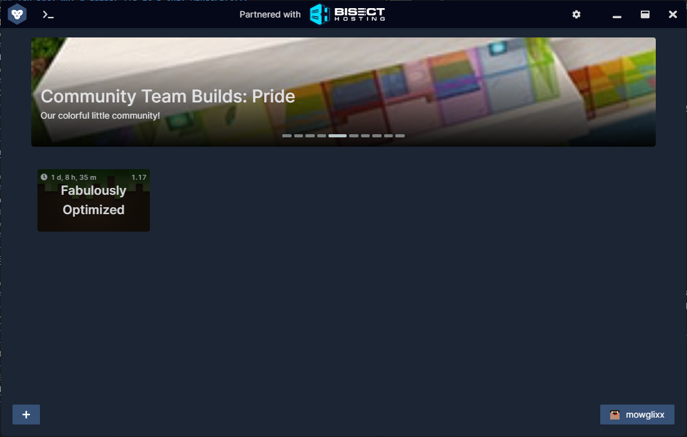
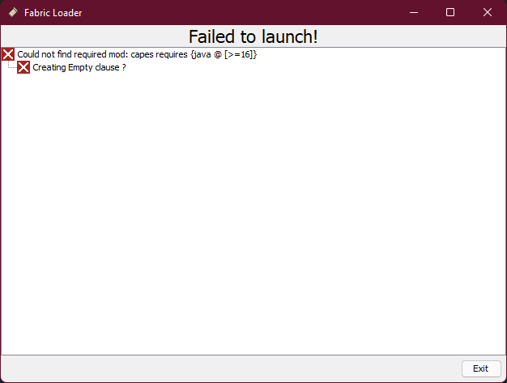
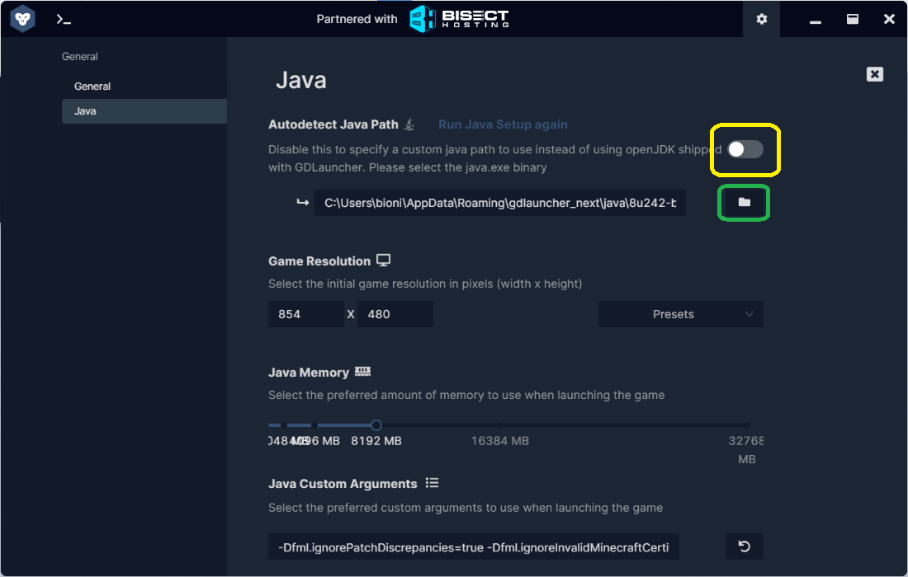
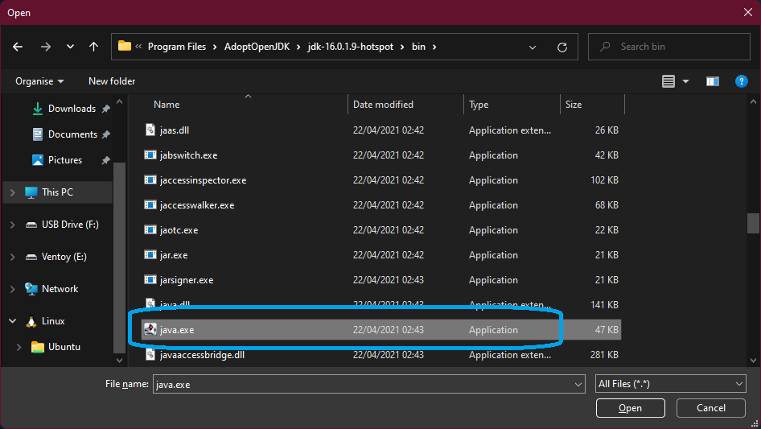

# cmcsmp modpack guide
**if you're playing on a POS laptop this should stop you from breaking it over your knee**
 A guide to install GD Launcher and Fabulously Optimized modpack for CMC-SMP for a better framerate in game

>Minecraft Java Edition runs like dog shit on anything less than a "nasa" pc, this modpack helped me play 1.16 on a computer from 2007 back before I got a ballin' PC, now I use it to play with shaders at a high framerate and without ALC crashes etc.
(mowglixx, 2021)
## What you'll need
Download all this before getting started

- **YOUR MINECRAFT LOGIN DETAILS** (too many of you don't know this)

- [GD Launcher](https://gdevs.io) - You don't HAVE to use this launcher but it's really good and it's open-source.

- [Java 16](https://adoptopenjdk.net/?variant=openjdk16&jvmVariant=hotspot)

- [Fabulously Optimized 1.17 Beta Modpack](https://www.curseforge.com/minecraft/modpacks/fabulously-optimized/files/3372364)

- [BSL 8 Shaders](https://www.curseforge.com/minecraft/customization/bsl-shaders/files/3229524) (Optional)

## Shaders
You don't need Optifine for shaders in this modpack, you won't get a shaders options screen so choose your shaders wisely. 

### Recommended Shaders: [BSL 8 Shaders](https://www.curseforge.com/minecraft/customization/bsl-shaders/files/3229524)

## Guide
- Install [GD Launcher](https://gdevs.io) AND [Java 16](https://adoptopenjdk.net/?variant=openjdk16&jvmVariant=hotspot)
- Open `GD Launcher` and login with your details Minecraft account
- Press the `down arrow` in the bottom right until you have gone through the tour and there is a little `+` in the bottom left
- Click on the `+` and then import the zip file for [Fabulously Optimized 1.17 Beta Modpack](https://www.curseforge.com/minecraft/modpacks/fabulously-optimized/files/3372364)
- After the import is complete your screen will look like this...
    
- At this point if you try to play the game you will get this error, it just means it need `Java 16`
    

### The Java 16 Bit...
- Go to settings in the top right
- Click Java on the left
- **Uncheck the "Autodetect Java Path" option (show in yellow)**
- **Click the Browse Files Button (shown in green)**
    
- Navigate to `C:\Program Files\AdoptOpenJDK\jdk-16.[version]` or wherever you installed it.
- **Select `java.exe` or just `java` (shown in Blue) in the `bin` folder** 
    

## FAQ
### Yeh but, why a guide? ffs it's only Minecraft...
As of `1.17`, Minecraft now requires `Java 16`+ instead of `Java 8/11` (Minecraft 1.16 and below). most you scrubs think java is just Minecraft when really Java is the language Minecraft is written in, You need the latest version of Java to run the Latest versions of Minecraft **BUT** because all the Mod Launchers like `GD Launcher`, `Curseforge Twitch`(or whatever it is now), `TLauncher` etc. all use Java 8 for Minecraft 1.16 and below here is where the problem is...
### why?
IDK, something something features... [Google it](https://www.google.com/search?q=why+am+i+asking+so+many+questions+about+minecraft).